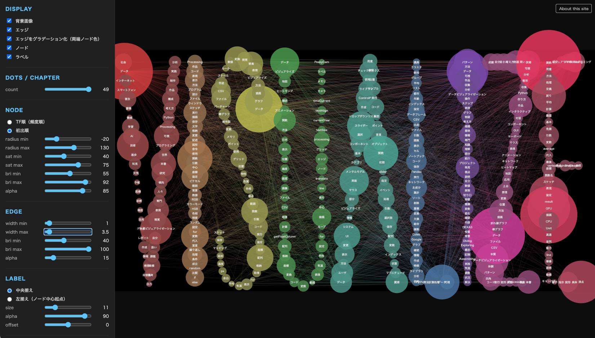

# book-cover-viz-generator

## 概要

本ツールは山辺真幸が執筆した書籍[『ProcessingとPythonではじめる データビジュアライゼーション入門』](https://www.keio-up.co.jp/np/isbn/9784766431223/)の表紙ビジュアル制作のために開発されました。

本書籍は、ProcessingとPythonを用いてデータビジュアライゼーションの基礎から応用までを解説する入門書です。

本書は、1章から6章、付録、前書き・後書きの計9セクションで構成されており、各章の内容を反映したビジュアル要素を表紙のデザインに採用しています。

「VISUALIZE」 の9文字を各セクションに割り当て、文字輪郭上に、各章のキーワードをノードとし、章をまたぐ単語の共起関係をエッジとして表現したグラフを重ねることで、書籍全体の内容を視覚的に象徴するデザインとなっています。

### デモ

**[https://masakick.github.io/book-cover-viz-generator/](https://masakick.github.io/book-cover-viz-generator/)**

[](https://masakick.github.io/book-cover-viz-generator/)

### 主な操作方法

1. 各スライダーでノード数・エッジ数・色相・サイズなどを調整する
2. ノードにマウスを重ねると、そのノードに接続されたエッジとノードだけがハイライトされ、該当する単語のラベルが表示される（共起関係をたどって探索できる）
3. 気に入ったバリエーションができたら **Download SVG** ボタンでSVGを保存する

### ビジュアルのコントロール

| コントロール | 内容 |
|---|---|
| Dots / Chapter | 章ごとに配置するノード数 |
| Edge Count | 表示するエッジ数 |
| Node Hue / Saturation | ノードの色相・彩度 |
| Edge Gradient | エッジに章ごとのグラデーションを適用するか |
| Node Order | ノードをTFランク順 / 初出順で並べる |
| Label Align | ラベルを中央揃え / 左揃えにする |


## 仕組み

3つのCSVと背景画像を組み合わせています：

- `data/tf_by_chapter.csv` — 章ごとの名詞TFランキング（上位50語）
- `data/dot_positions.csv` — `VISUALIZE` 文字輪郭上のドット座標
- `data/cooccurrence.csv` — 章間の単語共起ペア
- `data/visualize_base.png` — 背景画像（1920×964px）

ドット座標は弧長等間隔にリサンプリングされるため、ノード数を減らしても文字輪郭全体に均一に配置されます。出力SVGはIllustratorで開くと `background` / `edges` / `nodes` / `labels` の4レイヤに分離されます。

## ローカル実行

`fetch()` がHTTPを必要とするため、静的サーバー経由で起動してください：

```bash
git clone https://github.com/masakick/book-cover-viz-generator.git
cd book-cover-viz-generator
python3 -m http.server 8000
```

ブラウザで [http://localhost:8000](http://localhost:8000) を開く。

データファイルを更新した場合はハードリロード（`Cmd+Shift+R`）でキャッシュを無効化してください。

## ライセンス

MIT License — 詳細は [LICENSE](LICENSE) を参照。

<details>
<summary>データ更新・開発者向け情報</summary>

[docs/DEVELOPMENT.md](docs/DEVELOPMENT.md) を参照してください。

</details>
